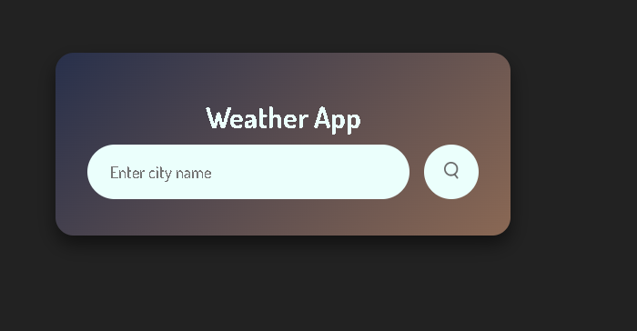

# Weather App

A simple and modern weather application that allows users to search for the current weather in any city.

## Features
- Search for weather by city name
- Displays temperature, humidity, wind speed, and weather icon
- Responsive and clean UI

## How to Use
1. Enter a city name in the search bar at the top.
2. Click the search icon or press Enter.
3. The app will display the current weather information for the entered city.

## Technologies Used
- HTML
- CSS
- JavaScript
- [OpenWeatherMap API](https://openweathermap.org/api)

## Setup
1. Clone or download this repository.
2. Open `index.html` in your browser.
3. Make sure you have an active internet connection for API requests.

## Screenshots

---

Feel free to customize and enhance this project!
